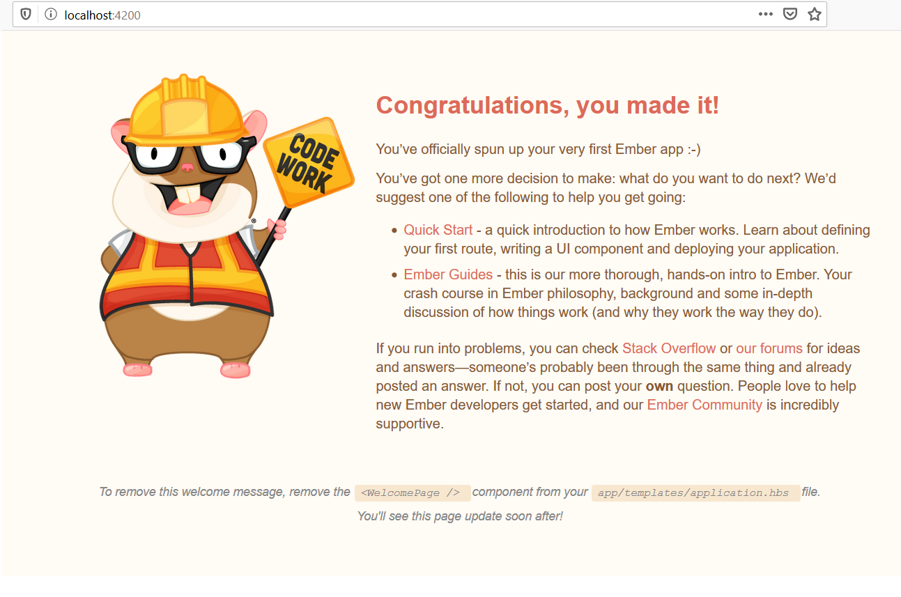

                                                            _...,
                                                         ,:^;,...;
                  -+===;.         ,,--++====++-,,,     .:  /.....,
                :::::~+++++#:,+#++++++++++++++++++#*..:   /,......
               (,,,,,,::=+++##++++++++++++++++++++++#.   :....../
                ...,,,,,::++++++++++++++++++++++++++++++*..,...:
                *..+...,#@@@@@@@@@++++++++++++++++++++++#*....*
                  @#,;##############@@@+*+#@@@@@@@@@@#*++#..<
                  *@##@@+,-*^^^*-+@####@@@######@@@#####@@,,,+
                    @#@*            @#@@@@#@@+--*^^*--#@@@@@@#
                    @#@.    @#      @##+++@#,           .@@#@@
                     #@#    @@     +@@++++#@@     @@     :@@
                     :@#*         @#@++++++@#*    #@     @@+
                    :*+@@#;,.__.+@#@+,-^^.++@#          @@++
                   ;*  :*@@@##@@@@;++r._j^.+@##@+,.__,,@@++.
                  /*    ........+++++++++++++#@@@@@###@@#++++,
                ,:       ...,@@@#++===----==@@@####,,....+++++
               .:       ......@@##@\   ;   :@####@,,...... +++.
               ;       .........@###,   ;  ;xx#@;,,.....   *;+,
               |       ........,*;xxxx--^--=xxx,........   :+#;
               ;         ......,,;xxxxxxxxxxxxx;,.....     *+#
                ;          ......,::xxxx;.     ......       +.   .
                 *;            .........  +###  ....       / ,. /:| ,.
                   .+:             ...  ;##++##, .      ,#. (..v..;*./
                      **                ##  ###*    .:*&&&+. \.,....<,
                       #&+**==-..,,__  ;##  ###  :,*+&&&&&&&v+#&,,.._/
                      #&&&&*...,::,,.  ##; ,##* .*****;:&&&&&&&&&
                     ,+*+;~*..*** *.* ### ###* *******    *+#&;*
                                      ##,;##    ****    :,  **
             #####    ##   ###  ###,  ########       .#####   ;##  ##
            #######  ;##  #### ,###.  ##########    ########  ### ####
           ###  ###  ### ##########   ####  ####   ,##   ###  #######*
          ### ,###  ##############:   ##     ###  #### ,##   :#### ###  ##;
      ##########    ########### ##   .##    ,###  #######    ##### :######
        ######    .###### ####  ##   ###    ### ######*    :#####   ####
           #############  ####  ################    ######## ###
            #####*  *#*    #:   :###   *###*         *####    #*

# Emberjs quikstart

https://guides.emberjs.com/release/getting-started/quick-start/

Install global

    npm install -g ember-cli

### Create a New Application

    ember new [name]    

    // my example
    cd your-projects/
    ember new ember-quickstart

    // your-projects/ember-quickstart

Output...

    ember new emberjs-quickstart
    installing app
    Ember CLI v3.17.0

    Creating a new Ember app in C:\Users\flavi\Documents\codes-mygit\emberjs-quickstart:
    create .editorconfig
    create .ember-cli
    create .eslintignore
    create .eslintrc.js
    create .template-lintrc.js
    create .travis.yml
    create .watchmanconfig
    create README.md
    create app\app.js
    create app\components\.gitkeep
    create app\controllers\.gitkeep
    create app\helpers\.gitkeep
    create app\index.html
    create app\models\.gitkeep
    create app\router.js
    create app\routes\.gitkeep
    create app\styles\app.css
    create app\templates\application.hbs
    create config\environment.js
    create config\optional-features.json
    create config\targets.js
    create ember-cli-build.js
    create .gitignore
    create package.json
    create public\robots.txt
    create testem.js
    create tests\helpers\.gitkeep
    create tests\index.html
    create tests\integration\.gitkeep
    create tests\test-helper.js
    create tests\unit\.gitkeep
    create vendor\.gitkeep

    Installing packages... This might take a couple of minutes.
    npm: Installed dependencies

    Initializing git repository.
    Git: successfully initialized.

    Successfully created project emberjs-quickstart.
    Get started by typing:

    $ cd emberjs-quickstart
    $ npm start

    Happy coding!

### Start the development server

 ember serve

    Running without permission to symlink will degrade build performance.
    See https://cli.emberjs.com/release/appendix/windows/ for details.

    Build successful (20018ms) – Serving on http://localhost:4200/

    Slowest Nodes (totalTime >= 5%)                                                                                                            | Total (avg)
    -------------------------------------------------------------------------------------------------------------------------------------------+------------------------------------
    Babel: @ember/test-helpers (2)                                                                                                             | 3775ms (1887 ms)
    BroccoliMergeTrees (17)                                                                                                                    | 2185ms (128 ms)
    Babel: @ember-data/store (2)                                                                                                               | 1518ms (759 ms)
    BroccoliRollup (6)                                                                                                                         | 1438ms (239 ms)

